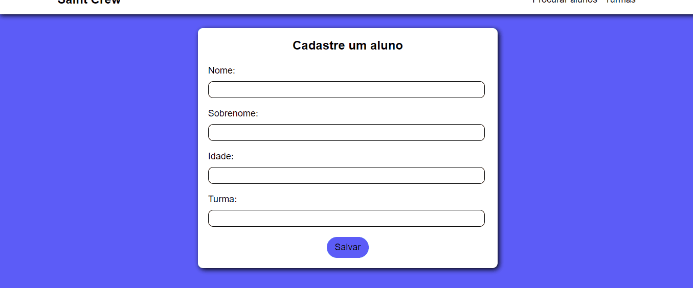
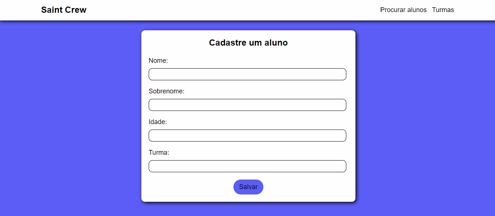
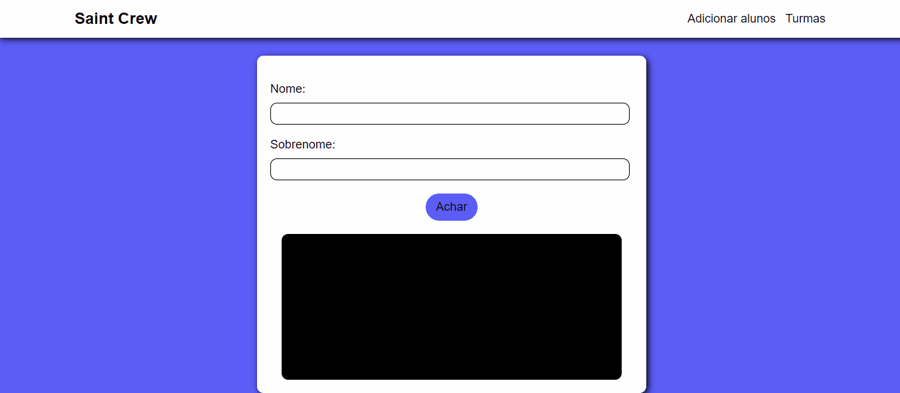
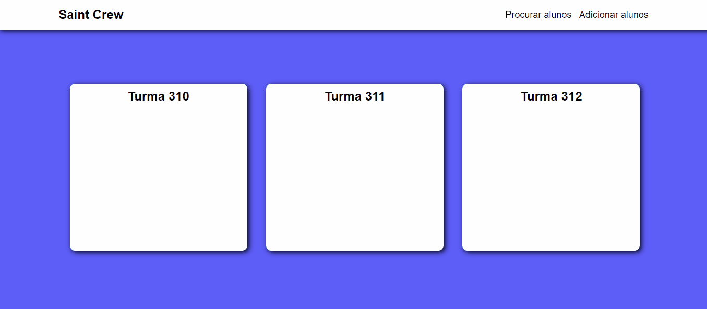

<h1 align="center">Saint crew</h1>

<p align="center">Este é um projeto de cadastro de alunos baseado em um sistema digital escolar que eu fiz usando umas tecnologias que estou estudando. (Saint Crew é apenas um nome genérico)</p>

<br>


### ✨ Features

- [x] Cadastrar um aluno
- [x] Procurar um aluno no sistema
- [x] Editar dados de um aluno
- [x] Apagar o aluno do sistema
- [x] Listar todos os alunos separados por turmas

<br>

<h1 align="center">
    
</h1>

<br>

<h1 align="center">
    
</h1>

<br>

<h1 align="center">
    
</h1>

<br>

<h1 align="center">
    
</h1>

<br>

<h1 align="center">
    
</h1>

<br>

### Pré-requisitos

Antes de começar você vai precisar ter instalado as seguintes ferramentas:<br><br>
[Git](https://git-scm.com)<br> [NodeJS](https://nodejs.org/en)<br>
Além disso um editor de códigos como o [VsCode](https://code.visualstudio.com/)

<br>

### 🥎 Rodando o front-end

```bash

# Clone este repositório
$ git clone <https://github.com/Kakaziu/SaintCrew>

# Acesse a pasta do projeto
$ cd saint_crew

# Instale as dependências
$ npm i

# Inicie a aplicação
$ npm start
```

<br>

### 🔨 Tecnologias

Para fazer este projeto foram utilizadas as seguintes tecnologias:

[Javascript](https://www.javascript.com/)<br>
[NodeJs](https://nodejs.org/en)<br>
[Express](https://expressjs.com/pt-br/)<br>
[MongoDB](https://www.mongodb.com/)

<hr>

Feito por Kakaziu (Kauã Ferreira Borba) ❤️ | [Linkedin](https://www.linkedin.com/in/kau%C3%A3-borba-390946235/)

